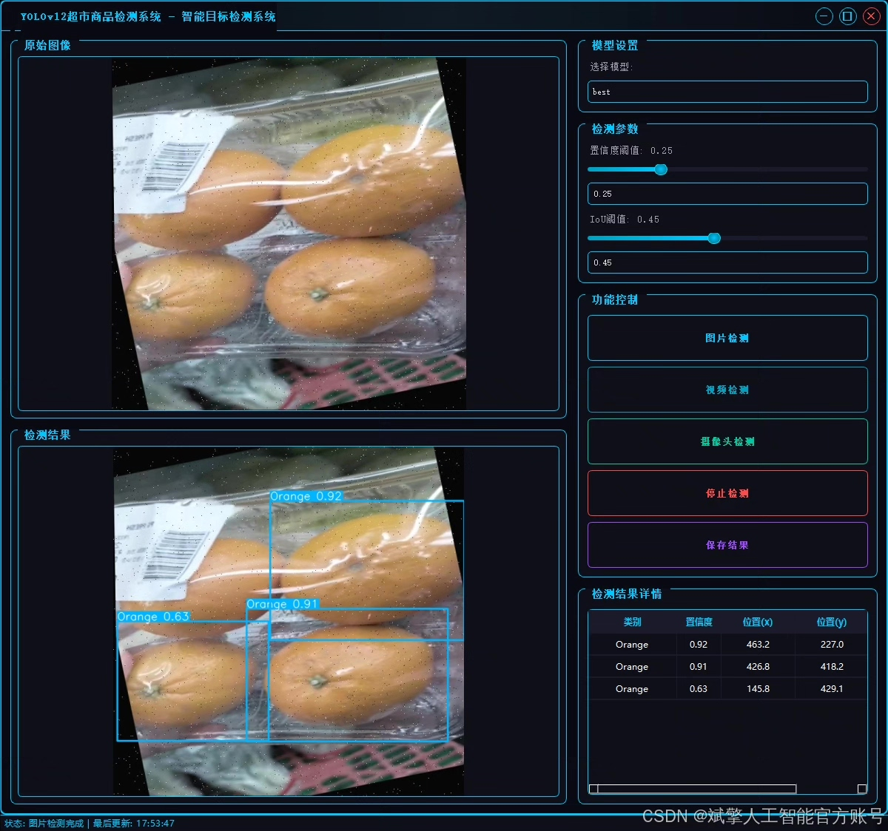
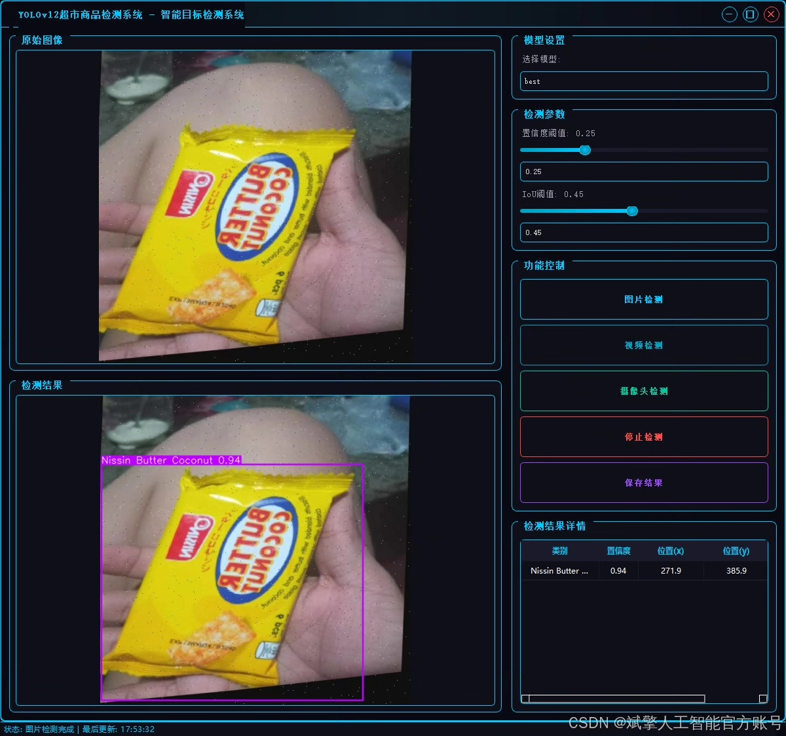
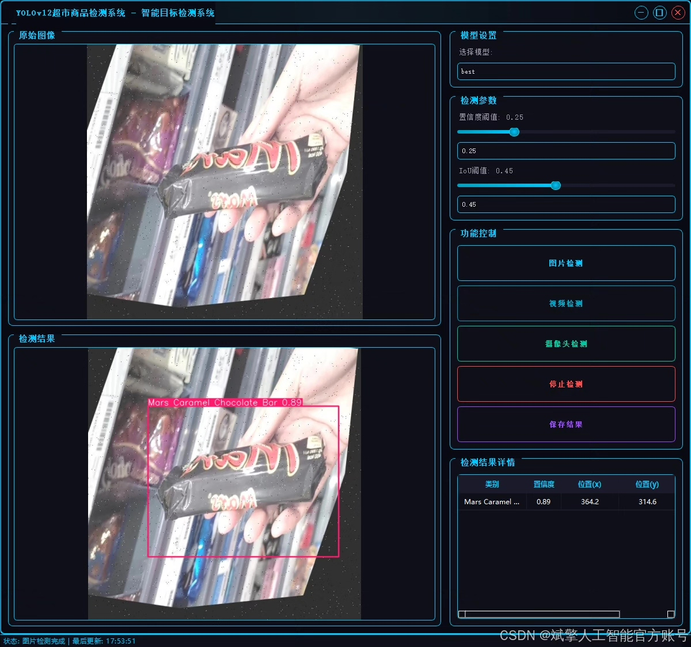
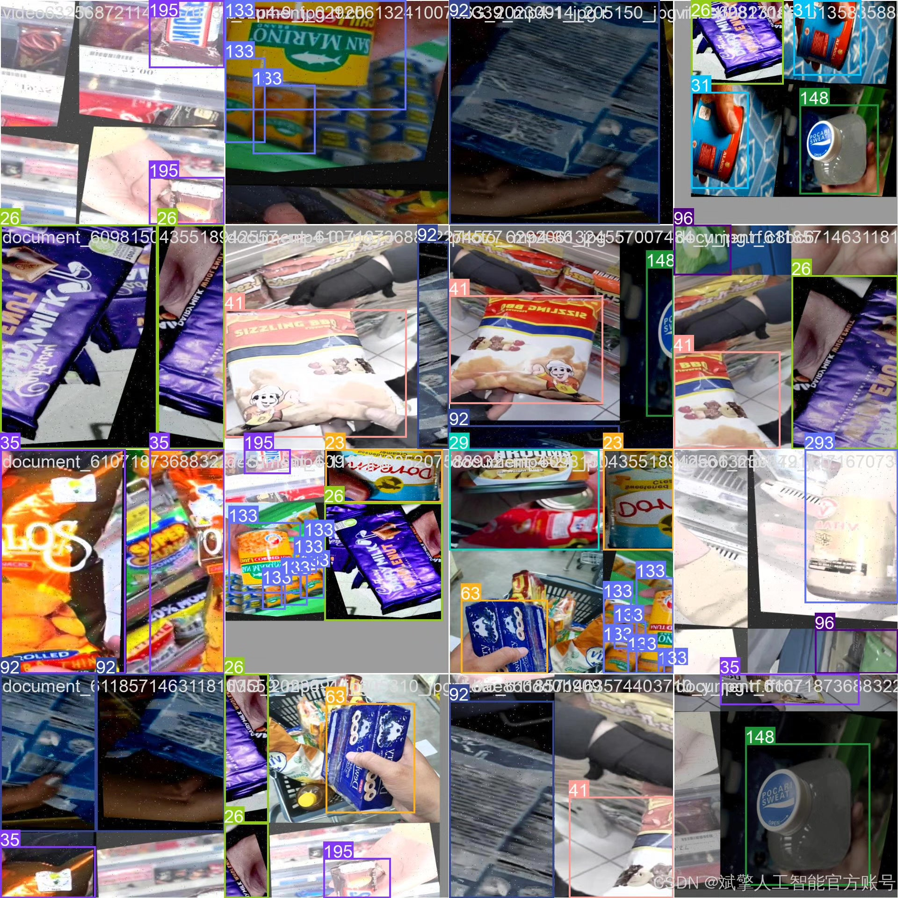
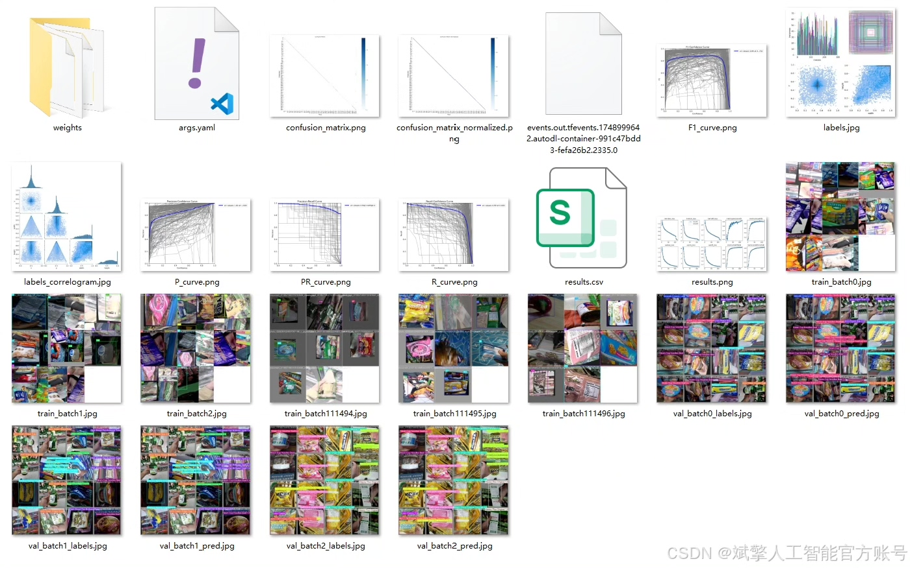
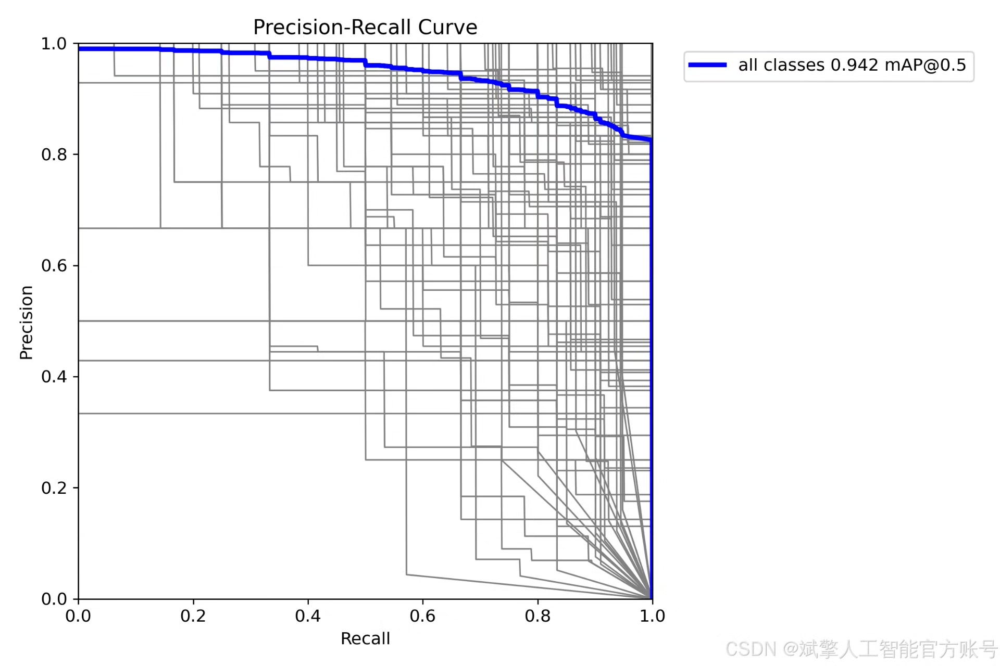
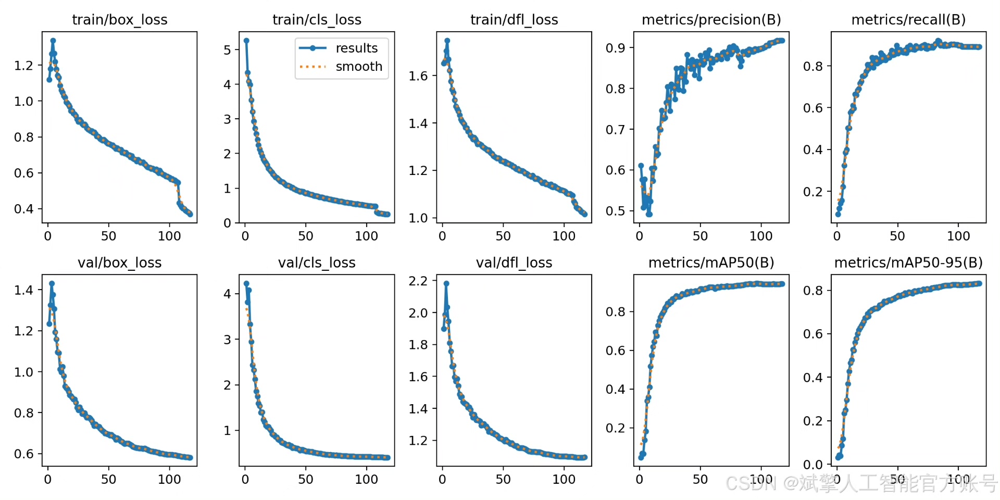
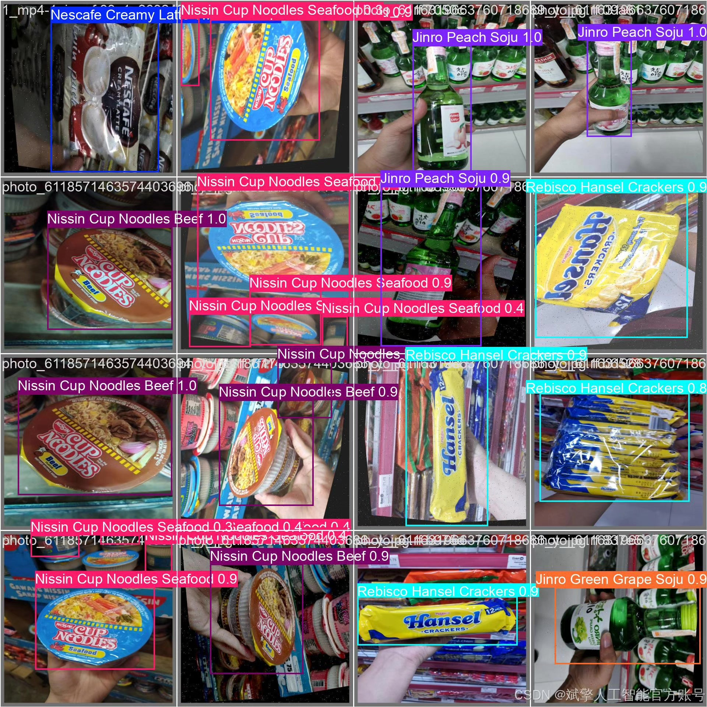

# YOLOv12 Supermarket Goods Recognition System

## Body

The supermarket product recognition system based on deep learning YOLOv12 (YOLOv12+YOLO dataset + UI interface + login registration interface + Python project source code + model)

With the rapid development of the retail industry, intelligent product recognition technology is increasingly widely used in supermarket management. This paper designs and implements an efficient supermarket product recognition detection system based on the YOLOv12 deep learning algorithm. The system can accurately recognize 295 common products, covering beverages, snacks, condiments, fresh produce, and more categories. The project adopts a large-scale labeled dataset (8336 training images, 2163 validation images), combined with a user-friendly UI interface and login registration functions, realizing the entire process from data collection to model deployment. Experiments show that the system maintains high detection accuracy and real-time performance under complex scenarios, providing feasible technical solutions for intelligent retail and automatic checkout.

✅ User login registration: Supports password verification and security validation.
✅ Three detection modes: Based on the YOLOv12 model, supports image, video, and real-time camera detection, accurately recognizing targets.
✅ Dual screen comparison: Displays the original scene and detection results on the same screen.
✅ Data visualization: Real-time table displays the category, confidence, and coordinates of detected targets.
✅ Intelligent parameter adjustment: Offers a confidence slide bar to dynamically optimize detection accuracy, adapting to different scene requirements.
✅ Sci-fi style interactive interface: Dark theme paired with dynamic light effects, reducing visual fatigue and improving operational experience.

## Images

## Payment

Here is a pay link on Stripe ( https://buy.stripe.com/3cs8yP7sY87d0vu9AB ). Please contact me lonlonago@foxmail.com after funding $89, and I will send you a complete data files , thank you!

